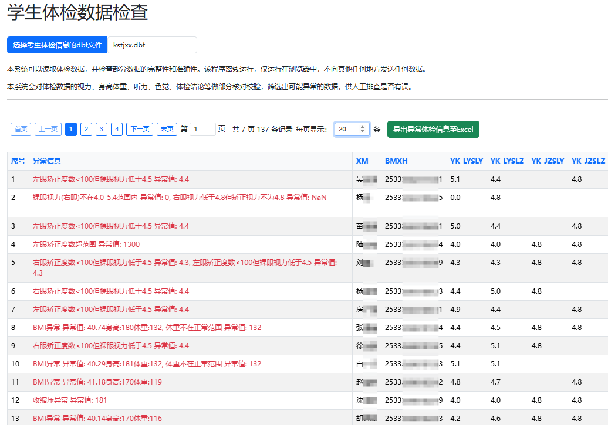

# 学生体检数据检查工具

## 项目简介
这是一个用于检查学生体检数据的 HTML 应用程序。该工具可以帮助用户快速识别体检数据中的异常值和不一致性，确保数据的准确性和完整性。

### 界面截图

## 功能特点
- **DBF文件导入**：支持直接导入DBF格式的体检数据文件
- **数据验证**：根据预设规则自动检查体检数据的有效性
- **异常数据展示**：以表格形式展示所有异常数据，并提供详细的异常信息
- **数据排序**：支持按任意列进行数据排序
- **分页显示**：大量数据自动分页，提高浏览体验
- **数据导出**：支持将异常数据导出为Excel文件，方便后续处理
- **数据安全**：所有数据处理均在用户本地进行，无需上传到服务器，确保数据隐私

## 检查项目
该工具可以检查以下体检数据项目：
- 视力（裸眼视力、矫正视力、矫正度数）
- 色觉
- 血压（收缩压、舒张压）
- 身高体重及BMI指数
- 听力
- 嗅觉
- 体检受限标志与体检依据标志的一致性

## 使用方法
1. 打开应用程序，这里使用 GitHub Pages 部署的在线版本：[https://sleepybear1113.github.io/tj-data-check/index.html](https://sleepybear1113.github.io/tj-data-check/index.html)
   或者下载项目文件到本地并打开index.html
2. 点击"选择DBF文件"按钮，选择需要检查的体检数据DBF文件
3. 查看检查结果，异常数据会以表格形式展示
4. 可以使用表格顶部的排序功能对数据进行排序
5. 可以使用分页控件浏览大量数据
6. 点击"导出Excel"按钮，将异常数据导出为Excel文件

## 技术架构
- **前端框架**：Vue.js 3
- **UI组件**：Bootstrap 5
- **Excel处理**：SheetJS (xlsx)
- **数据处理**：Web Worker技术（提高性能，避免主线程阻塞）

## 数据处理流程
1. 用户选择DBF文件
2. 系统使用Web Worker在后台处理文件
3. 数据按照预设规则进行验证
4. 将验证结果返回给主线程
5. 在界面上展示异常数据

## 本地部署
由于该应用是纯前端项目，无需服务器支持，可以通过以下方式部署：
1. 将项目文件复制到任意目录
2. 直接在浏览器中打开index.html文件